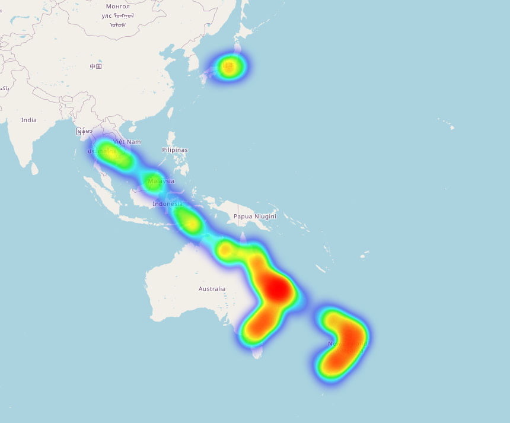

# Google Maps Timeline Data Parser

This is a simple Python script that parses the JSON data from Google Maps Timeline and outputs it in a more readable format.

- Creates a heatmap of all the locations you've been to.
- Creates a GPX file with all the locations you've been to.
- Creates an SQLite database with all the locations you've been to.

## Usage

1. Go to [Google Maps Timeline](https://www.google.com/maps/timeline) and download your location history.
2. Extract the downloaded file.
3. Run the script with the path to the extracted JSON file as an argument.



Only one package (for the heatmap) is probably not installed by default. You can install it with the following command:
```bash
pip install folium
```